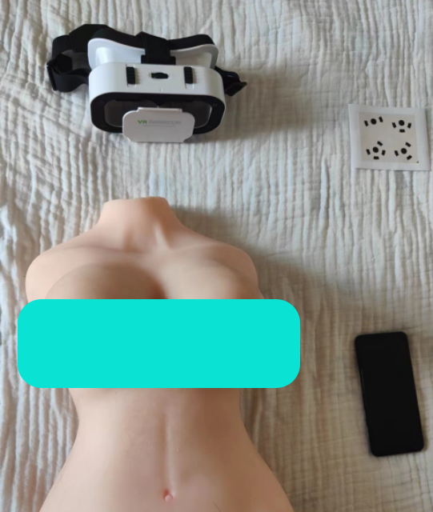
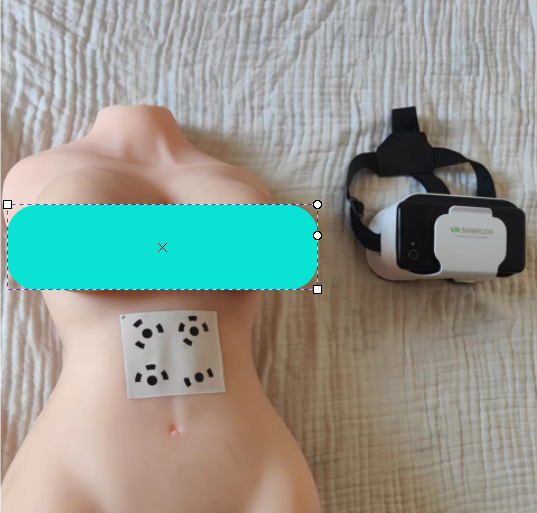
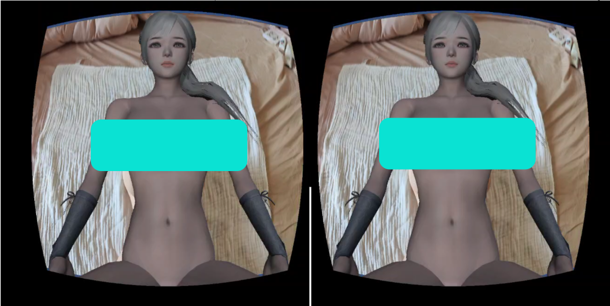
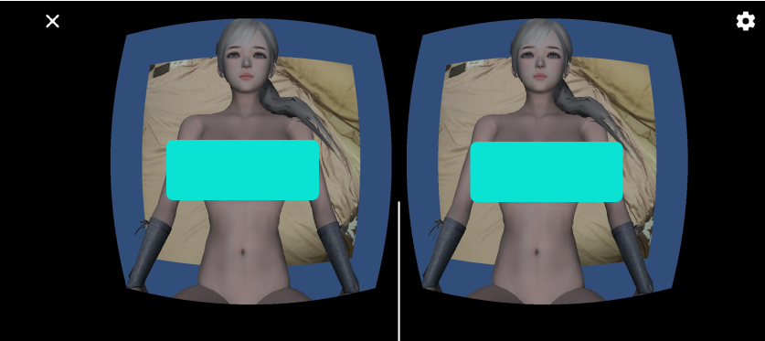

# A free XR APP for love dolls

# 説明 Usage

## STEP 1
* アプリ(Android)をダウンロードしてインストールする: [Link](https://drive.google.com/file/d/1-PaAzY6FD2ZE4sD4lgSFtJ1UBBcWPvdp/view?usp=drivesdk)
* Download the app from google drive: [Link](https://drive.google.com/file/d/1-PaAzY6FD2ZE4sD4lgSFtJ1UBBcWPvdp/view?usp=drivesdk) (currently only support android).
* 下载并安装APP（目前支持安卓）: [Google drive](https://drive.google.com/file/d/1-PaAzY6FD2ZE4sD4lgSFtJ1UBBcWPvdp/view?usp=drivesdk) [百度盘](https://pan.baidu.com/s/1lHJd9ONstHIfjzYVBCyf7g?pwd=h9gb)

## STEP 2
* マーカーをプリントアウトし、ラブドールに貼る
* Print out the marker and attach it to your doll.
* 打印marker然后贴在娃娃上

## STEP 3
* VRゴーグル（スマホのカメラが外に見えるタイプ）で3Dコンテンツを表示する
* (Optional) Put your smart phone to a 3D viewing devices (Google cardboard or VR glasses with camera cut out, just make sure the camera of your phone can see outside).
* 将手机放到VR眼镜中显示

## Troubleshooting
* UIから戻る時、青い枠が出るバグがあるので、スクリーンの左をタップするとバグが消せるはず
* When you return from the UI, there will be a blue border around the view. Just tap the left side of the screen to restore.
* 从UI返回的时候会有一个蓝色边框出现的bug,只要点一下左边屏幕就好了

## Update Log

# v2.0
* Add motion estimation algorithm for natural interaction.
* Optimize 3D models' poses
* Stop sould while not moving.